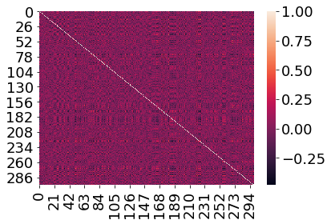

Using ``timecorr``
==================

``timecorr`` is used to approximate dynamic high-order correlations.
There are two steps to ``timecorr``:

1. Calculate dynamic correlations
2. Dimensionally reduce back to the original size of the data

By repeating these steps, you can approximate higher-order correlations
in a computationally tractable way. Although both of these steps can be
accomplished in just a single, we’ll go through and break it down.

Load in required libraries
==========================

.. code:: ipython3

    import timecorr as tc
    import numpy as np
    import seaborn as sns
    import warnings 
    warnings.simplefilter("ignore")
    %matplotlib inline

Simulate some data
==================

First, we’ll use the built in simulation function to simulate some
timeseries. By default, the ``simulate_data`` function will return a 100
samples from 1 subject, using ramping data generation function with 10
features and 5 blocks, but you can specify the number of time samples
with ``T``, the number of subjects with ``S``, and number of features
with ``K``. You can also set a random seed to get consistent results
across simulations. If you want further information on simulating data,
check out the simulate API page.

.. code:: ipython3

    # simulate 1 subject's timeseries 
    sim_1 = tc.simulate_data(S=1, T=200, K=300, set_random_seed=100)

.. code:: ipython3

    # output for 1 subject is an array
    print('shape : ' + str(np.shape(sim_1)))
    print('type : ' + str(type(sim_1)))

.. parsed-literal::

    shape : (200, 300)
    type : <class 'numpy.ndarray'>

.. code:: ipython3

    # simulate 3 subjects' timeseries
    sim_3 = tc.simulate_data(S=3, T=200, K=300, set_random_seed=100)

.. code:: ipython3

    # output for 3 subjects is a list of arrays
    print('shape : ' + str(np.shape(sim_3)))
    print('type : ' + str(type(sim_3)))
    print('type for sim_3[0] : ' + str(type(sim_3[0])))

.. parsed-literal::

    shape : (3, 200, 300)
    type : <class 'list'>
    type for sim_3[0] : <class 'numpy.ndarray'>

Calculate dynamic correlations
==============================

Now that we have a list of arrays of simulated timeseries data, we can
start using ``timecorr``. Let’s start by going over the way we calculate
dynamic correlations. We use a kernel based approach, and you can
specify but the type of kernel with ``weights_function`` and the width
with ``weights_params`` that you want to use to calculate the
correlations.

For this example, we’re going to use a gaussian kernel and a width of 5.
Here’s how:

.. code:: ipython3

    # specify kernel:
    width = 5
    gaussian = {'name': 'Gaussian', 'weights': tc.gaussian_weights, 'params': {'var': width}}
    
    # calcuate the dynamic correlations use a gaussian kernel and width of 5 for 1 simulate subject
    vec_corrs = tc.timecorr(sim_1, weights_function=gaussian['weights'], weights_params=gaussian['params'])

``timecorr`` returns a vectorized version of the correlation matrices.
Specifically, the upper triangle of correlation matrices. If you want
the full correlation matrices, use the ``vec2mat`` function. Also,
``mat2vec`` converts them back to the vectorized version.

.. code:: ipython3

    # returns moment-by-moment correlations, but just the upper triangle for the matrices
    print('vectorized shape : ' + str(np.shape(vec_corrs)))
    
    # use the vec2mat function to convert vectorized correlations to moment-by-moment full correlations 
    mat_corrs = tc.vec2mat(vec_corrs)
    
    # return the dynamic full correlations
    print('matrix shape : ' + str(np.shape(mat_corrs)))

.. parsed-literal::

    vectorized shape : (200, 45150)
    matrix shape : (300, 300, 200)

Let’s plot one of these full correlation matrices.

.. code:: ipython3

    sns.heatmap(mat_corrs[:, :, 100])

.. parsed-literal::

    <matplotlib.axes._subplots.AxesSubplot at 0x116d1d518>

Ok let’s now calculate the dynamic correlations for for the 3 simulated
subjects. The default ``cfun`` calculates a continuous verison of
Inter-Subject Functional Connectivity (Simony et al. 2017). If only one
data array is passed (rather than a list), the default cfun returns the
moment-by-moment correlations for that array. The default for the
``combine`` function is none, but for this example we’ll use
``corrmean_combine`` which calcuates the average correlations across
matrices. For more information on the different function options, please
check out the API documenation.

.. code:: ipython3

    # calcuate the dynamic isfc correlations use a Laplace kernel 
    # and width of 10 for 3 simulated subjects, and take the element-wise average correlations across matrices.
    width = 10
    laplace = {'name': 'Laplace', 'weights': tc.laplace_weights, 'params': {'scale': width}}
    
    dyna_corrs = tc.timecorr(sim_3, combine=tc.corrmean_combine, 
                             weights_function=laplace['weights'], weights_params=laplace['params'])

.. code:: ipython3

    # again, this returns the vectorized version of the dynamic correlations
    print('vectorized shape : ' + str(np.shape(dyna_corrs)))

.. parsed-literal::

    vectorized shape : (200, 45150)

Higher order correlations
=========================

Ok, now that we’ve gone over how to calculate dynamic correlations,
let’s walk through reducing the correlations back to the original size
of the data using the ``rfun`` parameter. Again, you have several
options. If you want more information, please checkout the API
documentation.

The default for ``rfun`` is ``None``, which we used for calculating the
dynamic correlations, but in this example we’ll use ``PCA``.

.. code:: ipython3

    # approximate the dynamic isfc correlation, using a Laplace kernel, width 10, and reducing using PCA
    width = 10
    laplace = {'name': 'Laplace', 'weights': tc.laplace_weights, 'params': {'scale': width}}
    
    dyna_corrs_reduced = tc.timecorr(sim_3, rfun='PCA', 
                                     weights_function=laplace['weights'], weights_params=laplace['params'])

.. code:: ipython3

    # this returns the approximated dynamic correlations the same size as the original data
    print('original shape : ' + str(np.shape(sim_3)))
    print('reduced shape : ' + str(np.shape(dyna_corrs_reduced)))

.. parsed-literal::

    original shape : (3, 200, 300)
    reduced shape : (3, 200, 300)

To calculate higher-order correlations, you can repeat this process up
to any order you want. For example, if we want to calculate correlations
up to the second order, we repeat this process twice.

.. code:: ipython3

    order_0 = sim_3
    
    order_1 = tc.timecorr(order_0, rfun='PCA', weights_function=laplace['weights'], weights_params=laplace['params'])
    
    order_2 = tc.timecorr(order_1, rfun='PCA', weights_function=laplace['weights'], weights_params=laplace['params'])

Ok, and that’s it!
